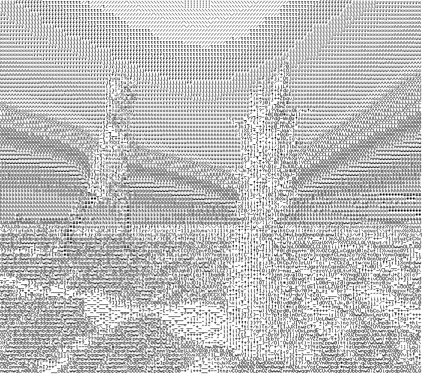

# PythonAsciiArtGenerator
Converts an image into an ASCII image by converting every pixel into a character based on brightness of color.
## How to run
1. Download the repository
2. Upload an image to the folder
3. Run main.py and input the file name of the image
4. Look at the result! (I recommend looking at the resulting text file in a text editor with the Terminal font and adjust the font size accordingly) 
## Here is an example

